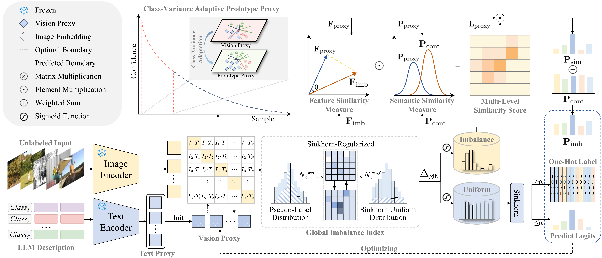

# PACER Supplementary Materials

> Submitted KBS paper: 
> ** Towards Real-World Scenarios: A Perceive-then-Calibrate Paradigm for Zero-Shot Recognition via Vision-Language Models**

Large-scale vision-language models (VLMs), such as CLIP, have established a powerful paradigm for zero-shot visual recognition by aligning images with text descriptions. However, directly applying them to downstream tasks is often hindered by the inherent modality gap. Recent state-of-the-art (SOTA) methods, represented by InMaP, attempt to bridge this gap by learning vision proxies under an ideal uniform distribution assumption. Yet, enforcing such a rigid uniform prior overlooks the inherent variability and natural skew of real-world data, inevitably distorting its intrinsic structure and compromising adaptation performance. To address this limitation, we propose PACER (Perceive And Calibrate for zEro-shot Recognition), a novel paradigm designed to dynamically adapt VLMs to arbitrary data distributions. Operating through a perceive-then-calibrate mechanism, our framework first introduces a novel Global Imbalance Index (GII) via entropy-regularized optimization, which acts as a distribution estimator to accurately measure the intrinsic data skewness. Guided by this perception, PACER explicitly disentangles the unknown dataset into uniformly distributed and imbalanced subsets, enabling the application of tailored calibration strategies. Specifically, for the uniform subset, we generate globally consistent pseudo-labels via Uniform Prior Alignment (UPA). Conversely, for the imbalanced subset, we introduce Distribution-Adaptive Proxies (DAP) to capture diverse intra-class characteristics and preserve the authentic data distribution.
Extensive experiments across 10 benchmark datasets demonstrate that PACER consistently achieves SOTA zero-shot recognition performance. Notably, it outperforms InMaP by 4.6 across all 10 downstream datasets and by a remarkable 10 on four imbalanced datasets, firmly validating its superiority and robustness in real-world scenarios.


## Requirements
* Python 3.9
* PyTorch 1.12
* [CLIP](https://github.com/openai/CLIP)

## How to Install

This code is built on top of the awesome toolbox [Dassl.pytorch](https://github.com/KaiyangZhou/Dassl.pytorch) so you need to install the `dassl` environment first. Simply follow the instructions described [here](https://github.com/KaiyangZhou/Dassl.pytorch#installation) to install `dassl` as well as PyTorch.

## Model Zoo

All used datasets could be prepared according to CoOp's [DATASETS.md](https://github.com/KaiyangZhou/CoOp/blob/main/DATASETS.md). Zero-shot Classification Task On the 10 datasets.

| Dataset      | PACER Acc. | Log                                 | Checkpoint                                             | 
| ------------ |----------|-------------------------------------|--------------------------------------------------------| 
| OxfordPets   | 93.1     | [Link](Logs/oxford_pets.txt)    | [Link](checkpoint/oxford_pets_image_classifier.pth)    | 
| Flowers102   | 80.8     | [Link](Logs/oxford_flowers.txt) | [Link](checkpoint/oxford_flowers_image_classifier.pth) | 
| FGVCAircraft | 29.9     | [Link](Logs/fgvc_aircraft.txt)  | [Link](checkpoint/fgvc_aircraft_image_classifier.pth)  | 
| DTD          | 58.1     | [Link](Logs/dtd.txt)            | [Link](checkpoint/dtd_image_classifier.pth)            | 
| EuroSAT      | 65.2     | [Link](Logs/eurosat.txt)        | [Link](checkpoint/eurosat_image_classifier.pth)        | 
| StanfordCars | 71.9     | [Link](Logs/stanford_cars.txt)  | [Link](checkpoint/stanford_cars_image_classifier.pth)  | 
| Food101      | 87.5     | [Link](Logs/food101.txt)        | [Link](checkpoint/food101_image_classifier.pth)        | 
| SUN397       | 72.9     | [Link](Logs/sun397.txt)         | [Link](checkpoint/sun397_image_classifier.pth)         | 
| Caltech101   | 94.3     | [Link](Logs/caltech101.txt)     | [Link](checkpoint/caltech-101_image_classifier.pth)    | 
| UCF101       | 79.1     | [Link](Logs/ucf101.txt)         | [Link](checkpoint/ucf101_image_classifier.pth)         | 
| Average      | 73.3     |                                     |                                                        | 

## Project Structure
- `main.py`: Main entry point file for our PACER
- `utils.py`: Utility function collection
- `datasets/`: Processing modules for various datasets
- `gpt3_prompts/` and `gpt_file_cafo/`: Includes LLM prompts

## Usage:
PACER with pre-trained ViT-B/16
```
python main.py -a ViT-B/16 --data_path /path/to/DATASET --dataset DATASET
```

### Parameter Description
All these parameters can be modified in `main.py`
- `-a`: `--arch`: Specified CLIP model architecture (Default: ViT-B/16)
- `--iters_proxy`: Number of total iterations for learning vision proxy (Default: 30)
- `--iters_sinkhorn`: Number of total iterations for optimizing Sinkhorn distance (Default: 20)
- `--data_path`: Dataset Path
- `--dataset`: Dataset Name
- `--lr`: Learning rate (Default: 10)
- `--alpha`: Confidence threshold (Default: 0.5)
- `--logits_ratio`: Residual weighting coefficient for fusing prototype-based prediction with the original model (Default: 0.3)


